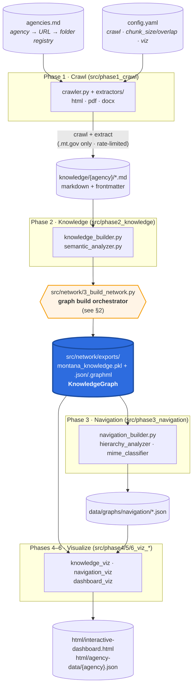
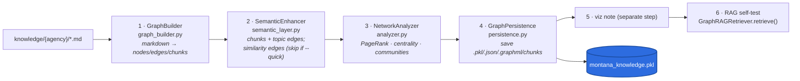
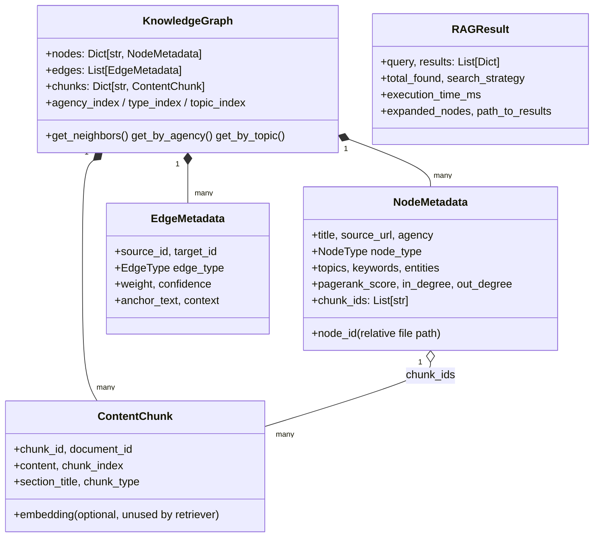
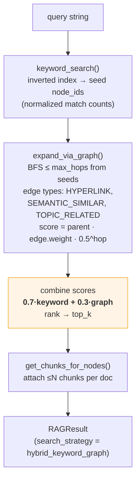
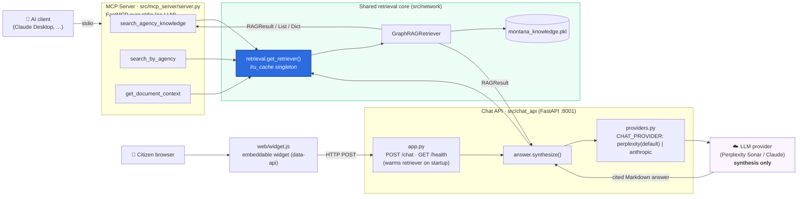
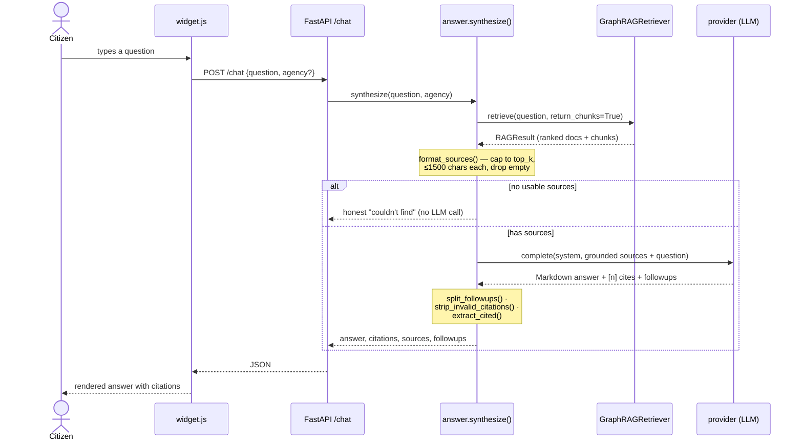

# Architecture — Montana Agency Knowledge Network

A technical walkthrough of how the system turns 37+ Montana state-agency websites into a
queryable knowledge graph, and serves it to AI clients and citizens. For a semi-technical
audience (engineers, technical PMs, stakeholders who read diagrams). Every box maps to a real
module; the diagrams were written against the code in `src/`, not just the high-level docs.

Core principle: **the `KnowledgeGraph` is the single source of truth.** Crawling produces it;
visualizations, navigation, and retrieval all read *from* it. Nothing downstream recomputes
relationships independently.

---

## 1. End-to-end pipeline (data flow)

Six phases turn raw agency websites into visualizations and a retrieval-ready graph. Each box
is a real module under `src/`; cylinders are generated artifacts (mostly gitignored).

**Data model (one agency → one graph):** one agency yields many markdown docs; those become a
single `KnowledgeGraph` where **nodes = documents** (`NodeMetadata`), **edges = relationships**
(`EdgeMetadata`), and **chunks = retrieval units** (`ContentChunk`).

---

## 2. The graph build orchestrator (`3_build_network.py`)

`scripts/run_all.py` and the per-phase CLIs drive things, but the graph itself is assembled by
`src/network/3_build_network.py`, which runs six internal steps (not to be confused with the
pipeline's phase1–6). `--quick` skips the expensive pairwise semantic-similarity edges.

Node types and edge types come straight from `schema.py`:

- **`NodeType`** — `HTML_PAGE`, `PDF_DOCUMENT`, `DOCX_DOCUMENT`, `INDEX_PAGE`, `POLICY_PAGE`,
  `PROGRAM_PAGE`, `AGENCY_ROOT`, `TOPIC_CLUSTER`.
- **`EdgeType`** — `HYPERLINK`, `CITATION`, `PARENT_CHILD`, `SEMANTIC_SIMILAR`, `TOPIC_RELATED`,
  `SAME_AGENCY`, `BELONGS_TO_AGENCY`, `TEMPORAL`.

---

## 3. The data contract (`schema.py`)

`schema.py` is **the contract** — change a field here and the builder, retriever, visualizer,
and every consumer change with it. Note that the three retriever methods do **not** return the
same type.

---

## 4. How retrieval actually works

`GraphRAGRetriever` (in `rag_retriever.py`) is **keyword + graph**, not vector search. At
construction it builds an inverted index over each node's keywords, topics, and title words.
A `retrieve()` call then:

`strategy` can be `"keyword"`, `"graph"`, or `"hybrid"` (default). The three public methods:

| Method | Returns | Used by |
|--------|---------|---------|
| `retrieve(query, top_k, strategy=…)` | **`RAGResult`** | `search_agency_knowledge` (MCP), chat `synthesize()` |
| `search_by_agency(agency, query)` | **`List[Dict]`** | `search_by_agency` (MCP) |
| `get_document_context(node_id, hops)` | **`Dict`** (related-by-link/topic/agency) | `get_document_context` (MCP) |

---

## 5. Two surfaces, one retrieval core

Both surfaces import the same `get_retriever()` singleton (`src/chat_api/retrieval.py`), an
`@lru_cache(maxsize=1)` that loads `montana_knowledge.pkl` once and wraps it in a
`GraphRAGRetriever`. Retrieval logic lives only in `src/network/`. The **LLM is called in
exactly one place** — `src/chat_api/providers.py` — for synthesis only; the MCP server never
calls an LLM (it returns structured results for the *client's* model to use).

| | MCP Server | Chat API |
|---|---|---|
| Transport | stdio (launched per AI client) | HTTP / FastAPI on :8001 |
| Consumer | AI assistants | Browser widget → citizens |
| LLM synthesis? | **No** — returns structured results | **Yes** — `providers.py` |
| Shared core | `get_retriever()` → `GraphRAGRetriever` over `montana_knowledge.pkl` | same |

---

## 6. Request lifecycle — a citizen question (`/chat`)

The chat path does real post-processing around the LLM call: it caps each source's text,
extracts a `<<FOLLOWUPS>>` block, strips citation markers that point past the source list, and
returns only the sources actually cited.

---

## Invariants worth remembering

- **Graph is source of truth** — change relationships in `graph_builder`/`semantic_layer`, then
  rebuild; never hand-patch downstream JSON/PKL.
- **`schema.py` is the contract** — change a field and all consumers together.
- **Two surfaces, one core** — never reimplement retrieval in a surface; keep it in `src/network/`.
- **Retrieval is keyword + graph BFS**, not embeddings — `ContentChunk.embedding` exists but the
  retriever doesn't use it. (A future vector layer would slot in here.)
- **One place calls the LLM** — `src/chat_api/providers.py`, synthesis only; swap via `CHAT_PROVIDER`.
- **Crawl safety** — `.mt.gov` hosts only, honor `config.yaml` rate limits; prefer `--dry-run` / `--update-only`.
